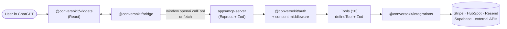
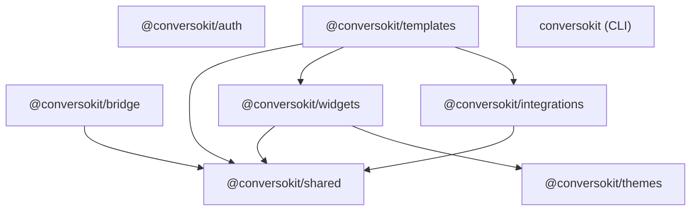
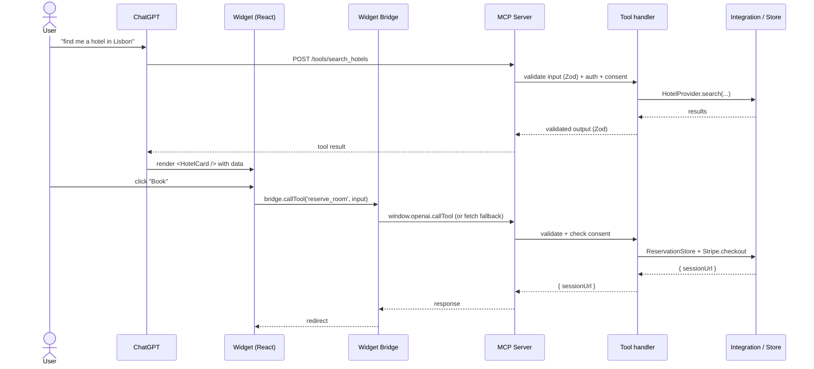

# ConversoKit

> **Latest:** v0.1.1 — see [CHANGELOG.md](./CHANGELOG.md).

Build production applications using the OpenAI Apps SDK and MCP.

Includes:

- Reusable widgets
- Commerce flows
- Booking flows
- Lead generation
- Templates
- Integrations
- MCP server starter
- React widget system

## Quick start

```bash
npx conversokit create my-app --template commerce
cd my-app
pnpm install
pnpm dev
```

Templates: `commerce`, `booking`, `saas-onboarding`, `travel`, `dashboard`.

Two services start in parallel:
- **MCP server** → http://localhost:3000 (`GET /health` is unauthenticated)
- **Widget UI** → http://localhost:5173

## Or fork the repo

```bash
git clone https://github.com/Xyborg/ConversoKit
cd ConversoKit
pnpm install
pnpm dev
```

The dev demo cycles through Commerce / Booking / Lead Gen / Travel / Dashboard tabs. Switch between 7 themes from the header.

## Architecture

### Data flow

A user prompt flows from ChatGPT to the MCP server, gets typed by Zod, hits an integration, and renders back as a themed React widget — same path in production as in local dev (the Widget Bridge picks `window.openai.callTool` when present, `fetch` otherwise).



### Package graph

The 8 publishable packages compose around `@conversokit/shared` (schemas/types). Templates pull widgets + integrations; widgets pull themes; auth and the CLI stand alone.



### Request lifecycle

Two phases per interaction: ChatGPT calls a tool to render a widget, then the widget calls a tool back through the bridge when the user takes action.



## Repo structure

```
ConversoKit/
├── apps/
│   ├── mcp-server/      # Express + Zod MCP tool server (16 tools, /health, /auth/:provider/*)
│   └── widget-ui/       # Vite + React widget host
├── packages/
│   ├── widgets/         # 19 reusable React widgets (CSS-vars themed)
│   ├── bridge/          # window.openai + fetch fallback
│   ├── templates/       # commerce / booking / saas-onboarding / travel / dashboard
│   ├── integrations/    # Payments: Stripe (real) + Mock
│   │                    # CRM: HubSpot (real) + Mock
│   │                    # Email: Resend (real) + Cloudflare Email (real) + Mock
│   │                    # Stores: Supabase (real) + InMemory
│   ├── auth/            # API key, JWT (HS256/JWKS via jose), anonymous,
│   │                    # OAuth (Google, GitHub, Microsoft, Auth0),
│   │                    # JWT-verify (Clerk JWKS, Supabase Auth)
│   ├── themes/          # 7 themes + ThemeProvider
│   ├── shared/          # Zod schemas, tool/widget contracts, mocks, compliance types
│   └── cli/             # `npx conversokit create | add | deploy`
├── examples/            # Per-template runnable references + roadmap stubs
├── docs/                # Setup, deployment, MCP basics, widget authoring,
│                        # integrations, compliance, app-review checklist
└── scripts/
```

## Scripts

| Command           | What it does                                  |
| ----------------- | --------------------------------------------- |
| `pnpm dev`        | Run all apps in parallel (turbo)              |
| `pnpm build`      | Build every package + app                     |
| `pnpm typecheck`  | Type-check every package                      |
| `pnpm test`       | Vitest smoke tests                            |
| `pnpm lint`       | ESLint over every package                     |

Filter to a single workspace:

```bash
pnpm --filter mcp-server dev
pnpm --filter widget-ui dev
pnpm --filter @conversokit/widgets dev
```

## Adding things

- **MCP tool** → new file in `apps/mcp-server/src/tools/`, append to the `tools` array in `tools/index.ts`. Tool shape: `defineTool({ name, description, inputSchema, outputSchema, permissions, handler })`.
- **Widget** → new component in `packages/widgets/src/`, export `<Name>Meta` + register in `registry.ts`.
- **Template** → new factory in `packages/templates/src/`, exported from `index.ts`. Tools and widgets are referenced **by name**.
- **Integration** → new file in `packages/integrations/src/` exporting an interface + a real impl + a mock fallback.

## Deploy

```bash
npx conversokit deploy vercel    # writes vercel.json + api/mcp.ts
npx conversokit deploy docker    # writes Dockerfile + docker-compose.yml
npx conversokit deploy railway   # writes railway.json + Procfile
```

Re-run with `--force` to overwrite. Each command prints the next-step CLI commands for that target. See [`docs/deployment.md`](./docs/deployment.md).

## Documentation

- [Setup](./docs/setup.md)
- [MCP basics](./docs/mcp-basics.md)
- [Widget authoring](./docs/widget-authoring.md)
- [Integrations](./docs/integrations.md)
- [Compliance](./docs/compliance.md)
- [Deployment](./docs/deployment.md)
- [App-review checklist](./docs/app-review-checklist.md)

## Requirements

- Node.js ≥ 18
- pnpm ≥ 8

## License

[Apache 2.0](./LICENSE).
